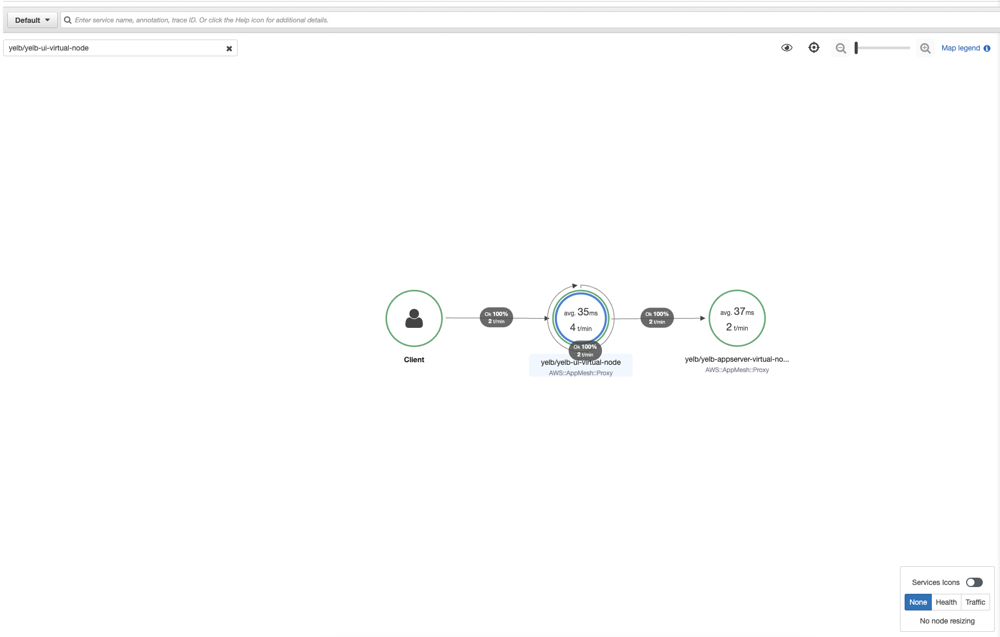

# Adding X-Ray

First we need to enable X-Ray on the AppMesh we use.

Update the `infra.py` file with new declaration for helm chart.

```python
        self.cluster.add_helm_chart('appmesh-controller',
                                    chart='appmesh-controller',
                                    repository='https://aws.github.io/eks-charts',
                                    release='appmesh-controller',
                                    create_namespace=True,
                                    namespace='appmesh-system',
                                    values={
                                        "tracing": {
                                            "enabled": "true",
                                            "provider": "x-ray"
                                        }
                                    }
                                    )
```

One we deploy the changes using:

```bash
cdk deploy infra
```

we should be able to have X-Ray enabled. As by default the pods don't have enabled X-Ray we need to restart them.

The easiest way for this demo is to replace and recreate them using this command:

```bash
kubectl get pod -n yelb -o yaml | kubectl replace --force -f -
```

After going to the application and restarting the page few times, we can login to X-Ray console and see the status of the X-Ray requests.

X-Ray Dashboard view



---

### Next

- [Adding Cloudwatch Logs](./Adding%20Cloudwatch%20Logs.MD)
